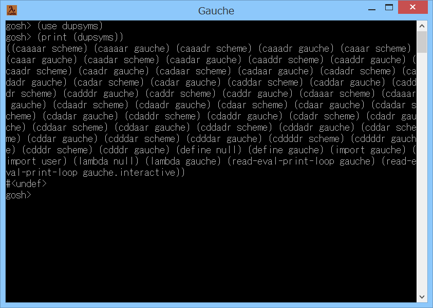

# dupsyms



## 概要
- Gauche で、import されたシンボルの重複チェックを行うためのモジュールです。

- 重複したシンボルは、R6RS ではエラー、R7RS では未定義動作になるので、  
  ポータブルなコードを書く場合には、注意が必要です。  
  (ただし REPL は対象外)

- ただし、現状の Gauche では、エラーにはならず、  
  後から定義したものが有効になります (shadowing) 。


## インストール方法
- dupsyms.scm を Gauche でロード可能なフォルダにコピーします。  
  (例えば (gauche-site-library-directory) で表示されるフォルダ等)


## 使い方
- 以下を実行します。
  ```
    (use dupsyms)
  ```
  以後、(dupsyms) で、重複したシンボルの情報を、  
  ((シンボル モジュール名) (シンボル モジュール名) ...) というリストの形で取得できます。  
  
  (同名のシンボルは、後のものの方が有効になっているはずです)


## その他 注意事項等
1. 本モジュールは、標準の gauche.interactive モジュールのソース (%apropos) を、  
   一部改造して使用しています。


## 環境等
- OS
  - Windows 8.1 (64bit)
- 言語
  - Gauche v0.9.8

## 履歴
- 2019-12-13 v1.00 (初版)
- 2019-12-13 v1.01 コメント追加のみ
- 2019-12-14 v1.02 内部処理修正(%aproposを改造版に変更)


(2019-12-14)
